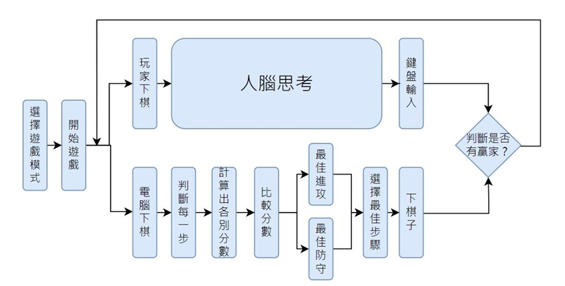
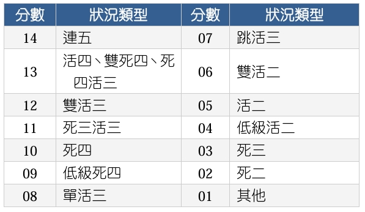
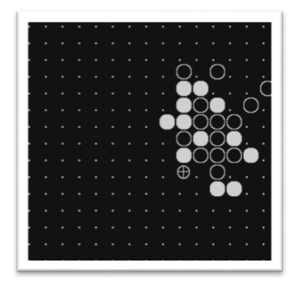
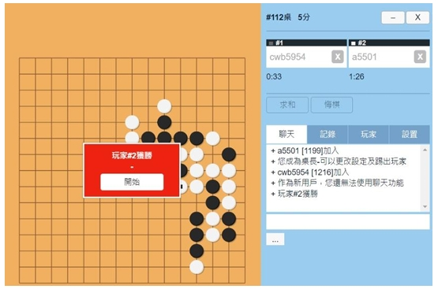

# 🏆 Smart Gomoku AI  

## 🎯 Project Overview  
This project aims to develop a **Gomoku AI** that allows players to compete against a computer opponent. The AI evaluates potential moves based on Gomoku rules and assigns scores to determine the **best move for victory**. The program achieves an **80% win rate** against other computer Gomoku programs in class, proving its effectiveness.  

---

## 🔍 Game Rules  
- Gomoku is played between **two players**, one using **black stones (●)** and the other using **white stones (○)**.  
- Players take turns placing one stone on an **empty board intersection**.  
- The **first player to align five stones in a row** (horizontally, vertically, or diagonally) **wins**.  

---

## 🧠 Decision-Making Strategy  
The **Smart Gomoku AI** follows a structured decision-making process:  
1. **Game Start** 🎮  
   - The user selects the **game mode** (human-first or AI-first).  
   - Players take turns placing stones on the board.

2. **Move Calculation** 🔢  
   - The AI evaluates **all possible moves** and assigns a **score** based on:  
     - **Winning Opportunities** ✅  
     - **Defensive Needs** 🛡️  
     - **Strategic Board Positioning** 📌  
   - The AI **chooses the highest-scoring move** as its next step.  

3. **Scoring System** 📊  
   - The AI follows **predefined Gomoku strategies** (as shown in the table below).  
   - It **prioritizes attack and defense dynamically**, switching between aggressive and defensive strategies based on game conditions.  

---

## 🖥️ Implementation & Controls  
- The **game board** is represented as a simple **matrix** in a graphical window:  
  - `0` → Empty space  
  - `1` → Black stone (●)  
  - `2` → White stone (○)  
  - `⊕` → Cursor for selecting move position  
- **Keyboard Controls:**  
  - **W / S / A / D** → Move the selection cursor  
  - **J** → Place a stone  

---

## 🏆 Results & Achievements  
✅ Successfully implemented a **fully functional AI opponent**  
✅ The AI **achieved 80% win rate** against other online Gomoku programs  
✅ **Outperforms human players (classmates)** due to faster calculations and strategic evaluation  

🎉 This project was an exciting journey into AI-based strategy games. Looking forward to **future advancements in deep learning** for even smarter gameplay! 🚀  

---
